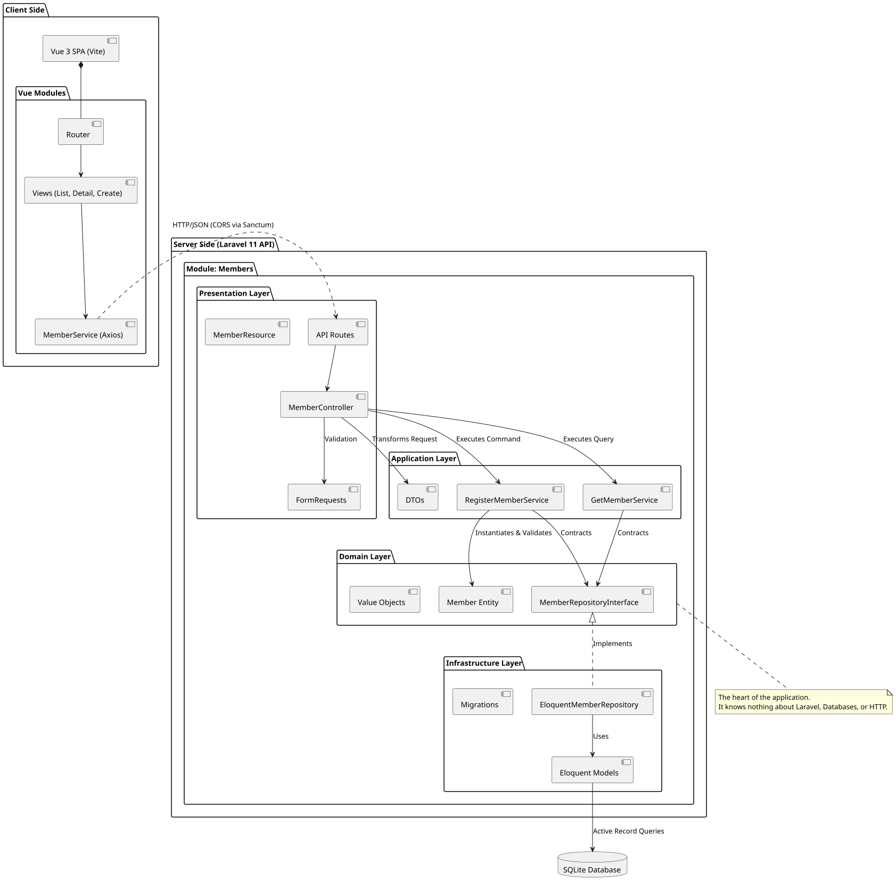

# System Architecture & Component Diagram

This document illustrates the physical and logical architecture of the system, focusing on how the frontend single-page application communicates with the modular, domain-driven backend.

## Component Diagram

## Architectural Design Choices

1. **Frontend**: A Vue 3 SPA built with Vite. It relies on a modular folder structure (`src/modules/members`) that mirrors the backend's bounded contexts, ensuring high cohesion.
2. **Backend Framework**: Laravel 11 running as a strict API backend.
3. **Domain-Driven Design (DDD)**: 
    - The backend is segmented into `app/Modules/{Context}`.
    - Strict layered architecture ensures that core business logic resides exclusively in the **Domain Layer**.
    - The **Application Layer** acts as the orchestrator.
    - The **Infrastructure Layer** handles Laravel-specific tools like Eloquent.
4. **Data Transfer Objects (DTOs)**: Used to transport data from the Presentation Layer to the Application Layer without leaking HTTP Request objects.
5. **Sanctum CORS**: API routing handles CORS dynamically for cross-origin requests locally (`localhost:5173` -> `localhost:8000`).
