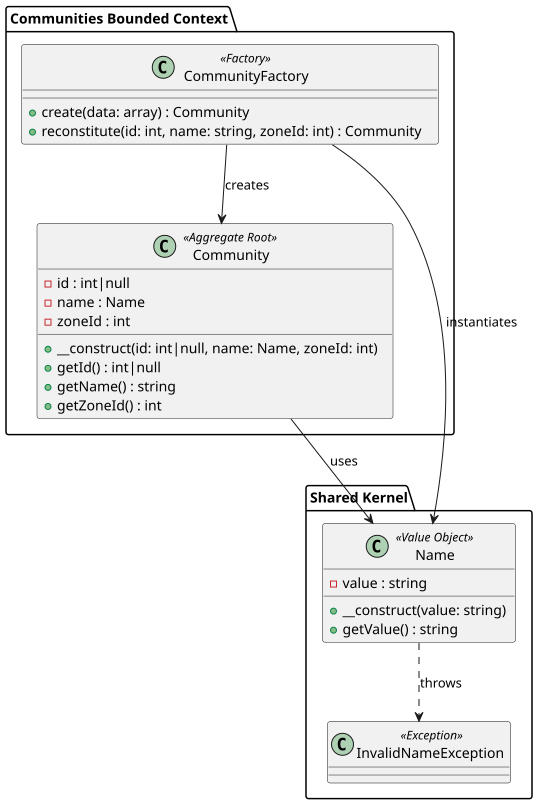
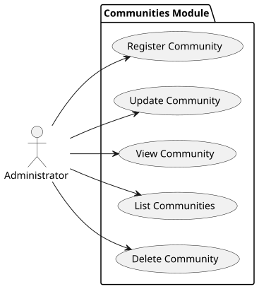
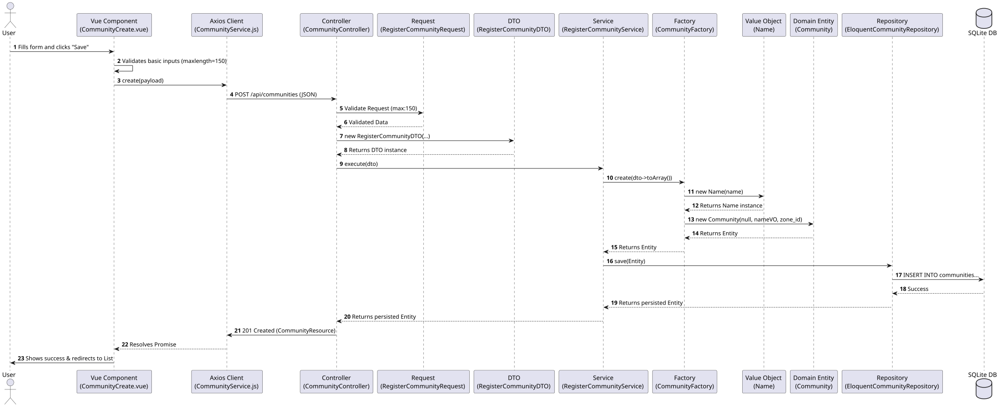
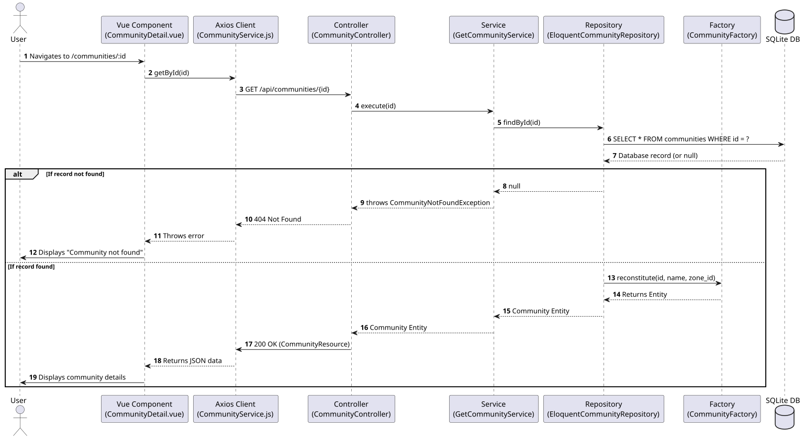

# Communities Module

This document outlines the Domain layer and Use Cases for the Communities bounded context.

## Domain Model Diagram

## Key Concepts

1. **Community (Aggregate Root)**: Represents a distinct geographical or administrative grouping of households within a zone.
2. **Zone (Aggregate Root)**: A larger grouping consisting of multiple communities.

## Use Cases

- **Register Community**: Allows an administrator to create a new community within a specific zone.
- **Update Community**: Modifies details of an existing community.
- **View Community**: Displays details for a single community.
- **List Communities**: Fetches a list of all communities.
- **Delete Community**: Removes a community from the system.

## Sequence & Flow Diagrams

### Registering a Community

### Fetching a Single Community

