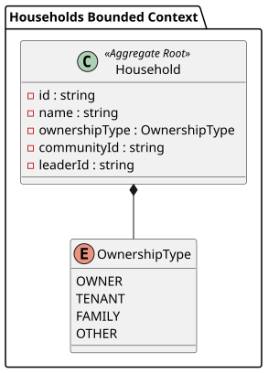
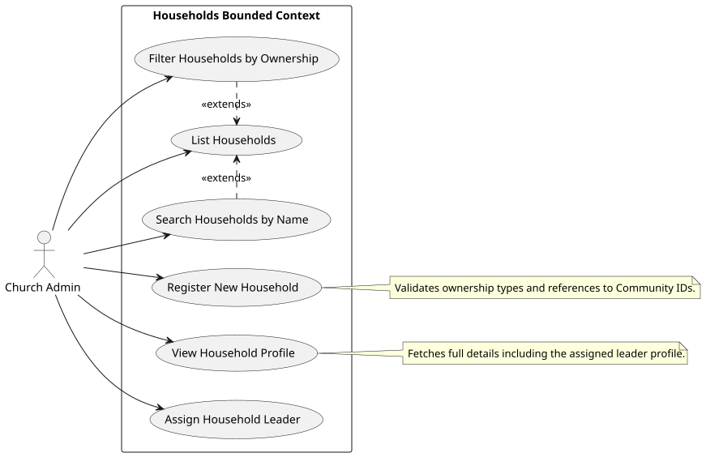

# Households Module

# Domain Layer: Households Bounded Context

This document outlines the Domain layer of the Households context, built using strict Domain-Driven Design (DDD) principles. The Domain layer is isolated from all framework-specific logic and infrastructure details.

## Domain Model Diagram

## Key Concepts

1. **Household (Aggregate Root)**: The primary entity for managing a family or group of individuals living together. Validates community assignments and optional leader associations.
2. **No Value Objects**: Following architectural decisions, the Household context does not utilize custom Value Objects, relying instead on primitives and strict entity validation.
3. **Enums (`OwnershipType`)**: Strongly typed constants to denote household property ownership (`owner`, `tenant`, `family`, `other`).
4. **HouseholdRepositoryInterface**: Contract for persisting Household aggregates, decoupling domain logic from the Eloquent implementation.

# Use Cases: Households Bounded Context

This document describes the high-level system interactions permitted within the Households context.

## Use Case Diagram

## Descriptions

- **Register New Household**: Allows an administrator to create a new household, assigning an ownership type and a community ID.
- **Assign Household Leader**: Allows assigning a member as the leader/head of the household during creation or edit.
- **View Household Profile**: Displays the household details, ownership type, and leader information.
- **List Households**: Displays a tabular view of all registered households.
- **Filter/Search Households**: Quickly locate households by name or narrow down by ownership type.

# Sequence & Flow Diagrams: Households Context

This document illustrates the step-by-step execution flow of the system, particularly emphasizing the separation of concerns imposed by Domain-Driven Design and CQRS principles within the Households Bounded Context.

## Registering a Household

This sequence diagram details the exact flow when a user submits the "Add Household" form.

## Fetching a Single Household

This flow demonstrates the read-side of the application when fetching a Household profile.

