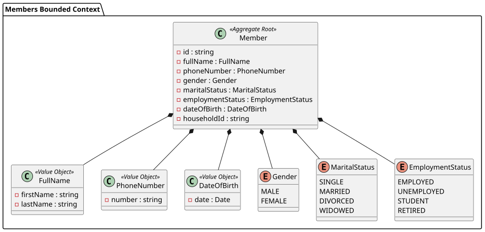

# Members Module

# Domain Layer: Members Bounded Context

This document outlines the Domain layer of the Members context, built using strict Domain-Driven Design (DDD) principles. The Domain layer is isolated from all framework-specific logic and infrastructure details.

## Domain Model Diagram

## Key Concepts

1. **Member (Aggregate Root)**: The primary entry point for managing a member's state. It ensures that any modifications to a member leave the entity in a valid state. Members contain a reference to their `household_id`.
2. **Value Objects (`FullName`, `PhoneNumber`)**: Immutable objects defined by their attributes rather than identity. They contain their own validation logic (e.g., `PhoneNumber` ensures the number matches valid Tanzanian mobile formats).
3. **Enums (`Gender`, `MaritalStatus`, `EmploymentStatus`)**: Strongly typed constants that replace string constants, preventing invalid states at the language level.
4. **MemberRepositoryInterface**: A contract that the Infrastructure layer must implement. The Domain dictates *what* is needed to save a Member, not *how* it's saved.

# Use Cases: Members Bounded Context

This document describes the high-level system interactions permitted within the Members context.

## Use Case Diagram

## Descriptions

- **Register New Member**: Allows an administrator to add a new member to the system and optionally assign them to a household. The system enforces domain rules (e.g., valid phone numbers, valid enums for gender/marital status).
- **View Member Profile**: Allows an administrator to click on a specific member in the directory to view detailed information, including their household association.
- **List Congregation Members**: Displays a tabular view of all registered members.
- **Filter/Search**: Allows administrators to quickly locate members by name or narrow down the list by employment status (e.g., "Student", "Employed").

# Sequence & Flow Diagrams: Members Context

This document illustrates the step-by-step execution flow of the system, particularly emphasizing the separation of concerns imposed by Domain-Driven Design and CQRS principles within the Members Bounded Context.

## Registering a Member

This sequence diagram details the exact flow when a user submits the "Add Member" form.

## Fetching a Single Member

This flow demonstrates the read-side of the application when fetching a Member profile.

