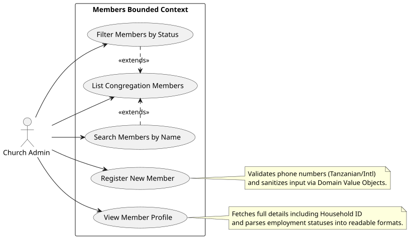

# Use Cases: Members Bounded Context

This document describes the high-level system interactions permitted within the Members context.

## Use Case Diagram

## Descriptions

- **Register New Member**: Allows an administrator to add a new member to the system and optionally assign them to a household. The system enforces domain rules (e.g., valid phone numbers, valid enums for gender/marital status).
- **View Member Profile**: Allows an administrator to click on a specific member in the directory to view detailed information, including their household association.
- **List Congregation Members**: Displays a tabular view of all registered members.
- **Filter/Search**: Allows administrators to quickly locate members by name or narrow down the list by employment status (e.g., "Student", "Employed").
