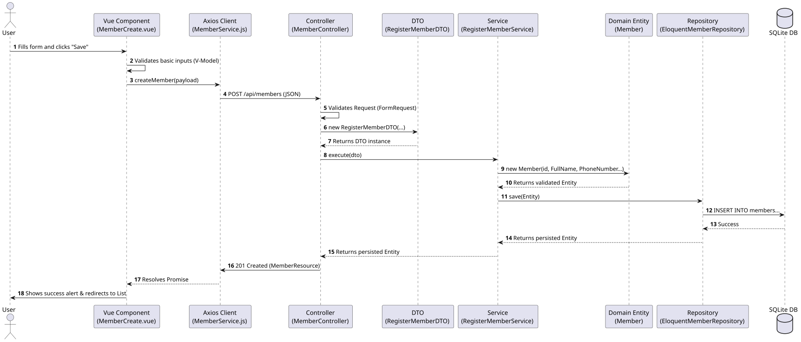
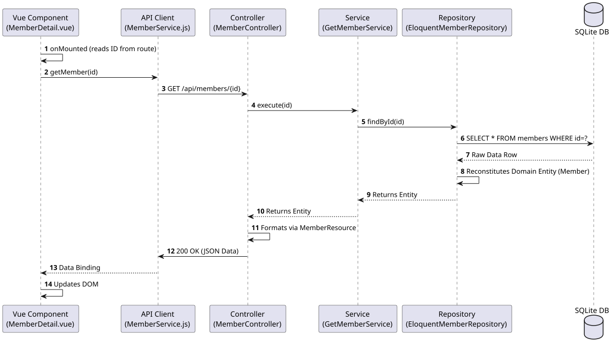

# Sequence & Flow Diagrams: Members Context

This document illustrates the step-by-step execution flow of the system, particularly emphasizing the separation of concerns imposed by Domain-Driven Design and CQRS principles within the Members Bounded Context.

## Registering a Member

This sequence diagram details the exact flow when a user submits the "Add Member" form.

## Fetching a Single Member

This flow demonstrates the read-side of the application when fetching a Member profile.

