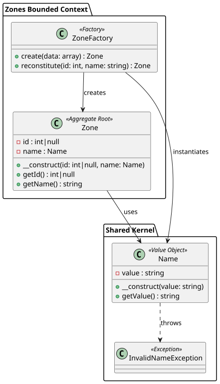
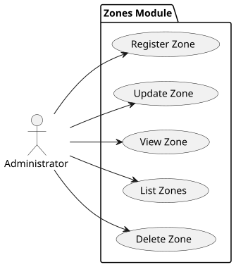
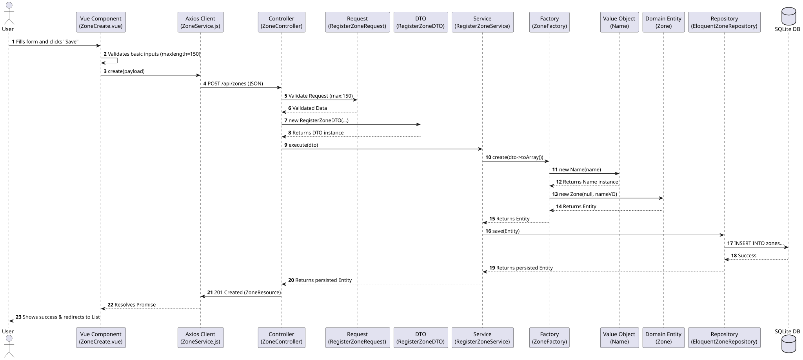
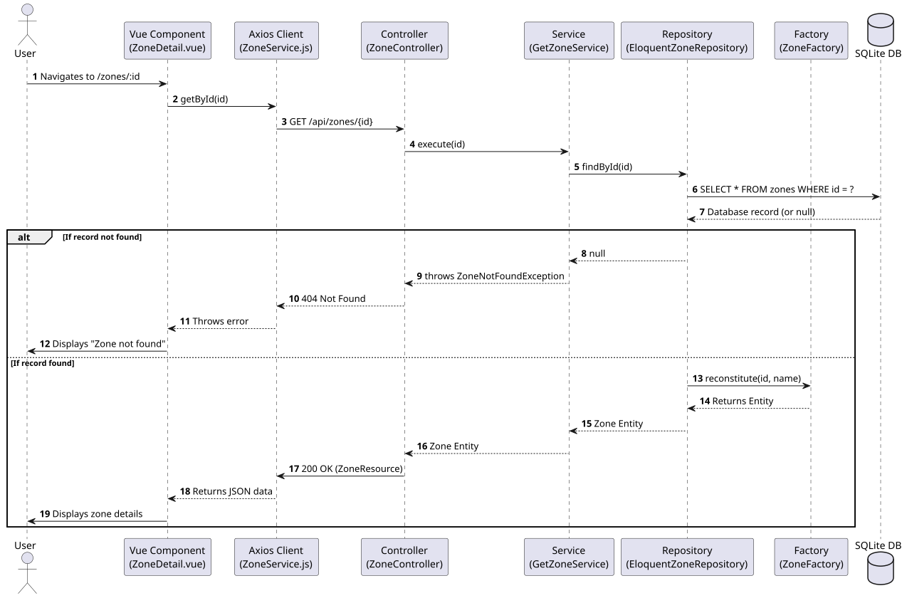

# Zones Module

This document outlines the Domain layer and Use Cases for the Zones bounded context.

## Domain Model Diagram

## Key Concepts

1. **Zone (Aggregate Root)**: The top-level regional grouping in the system. Contains multiple communities.

## Use Cases

- **Register Zone**: Allows an administrator to create a new zone.
- **Update Zone**: Modifies details of an existing zone.
- **View Zone**: Displays details for a single zone.
- **List Zones**: Fetches a list of all zones.
- **Delete Zone**: Removes a zone from the system.

## Sequence & Flow Diagrams

### Registering a Zone

### Fetching a Single Zone

